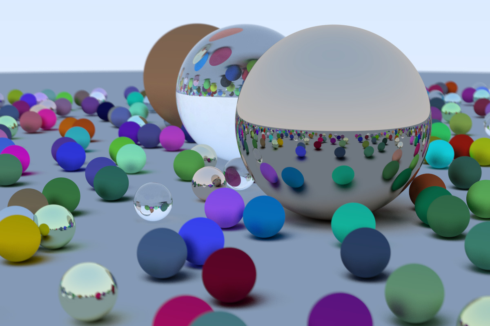

This is a personal project for learning offline graphics rendering using ray tracing techniques (software mode).

Resources used:
1. <a href="https://raytracing.github.io/">Ray Tracing in One Weekend</a>

The repo contains the Visual Studio(2022) solution directory of the project.

Currently the image is rendered to .ppm format.

The "/samples" directory contains sample renders converted to .jpeg format.

Sample render: 
1200x800, 500 samples per pixel, 50 ray depth 

